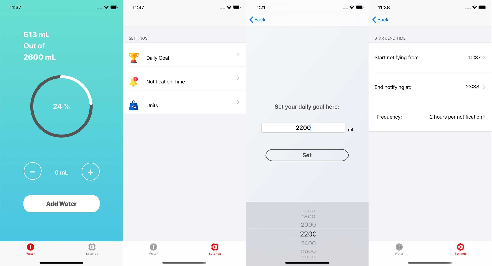

# DrinkWater, an app to notify users to drink water

Written in Swift 5, works well with iOS 13.1+, iPhone 11/XR screen size

Future work:
- Using charts to display user data history
- Implementing acheivement
- Working with Apple healthkit

